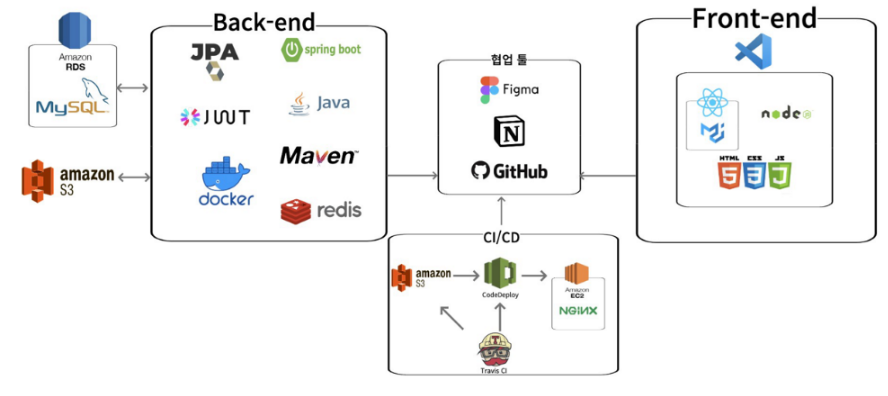
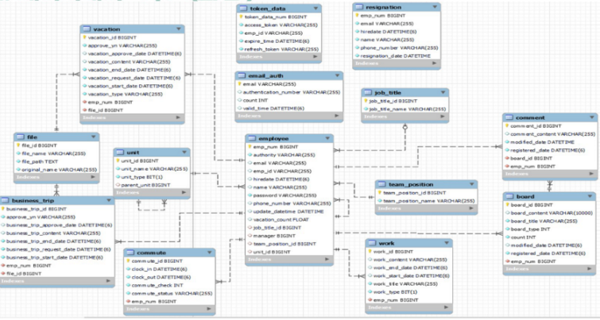
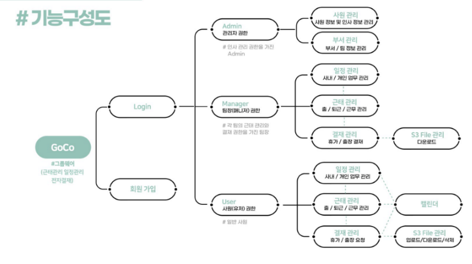
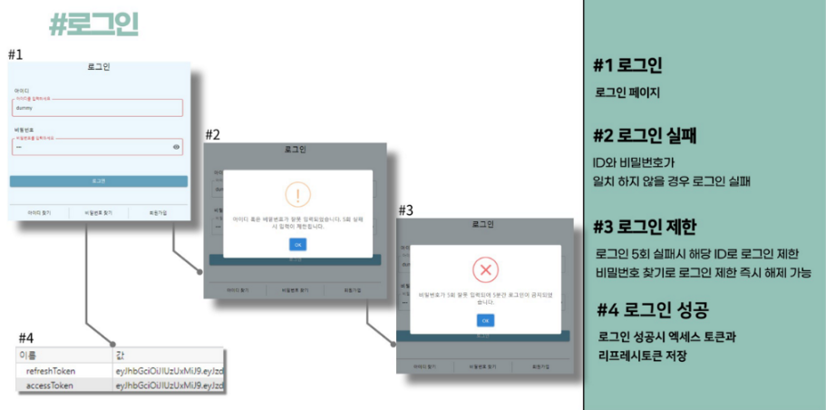
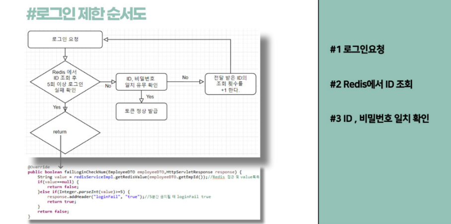
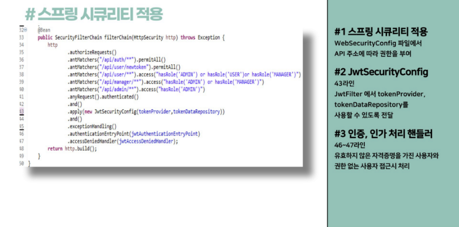
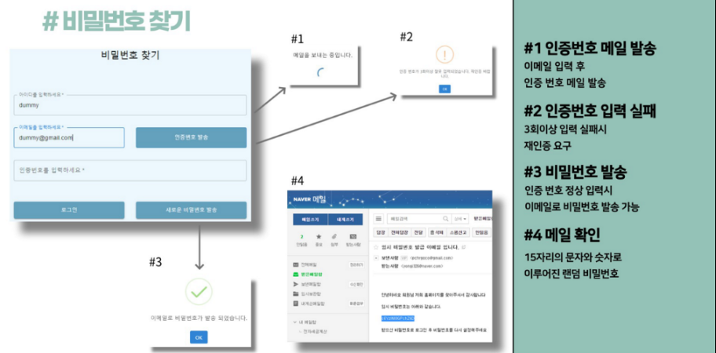
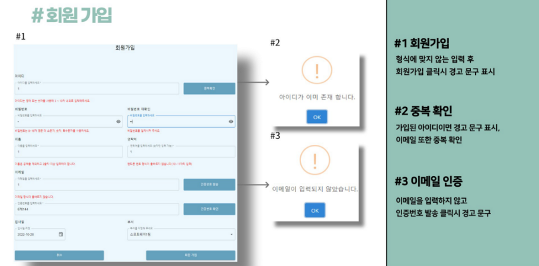
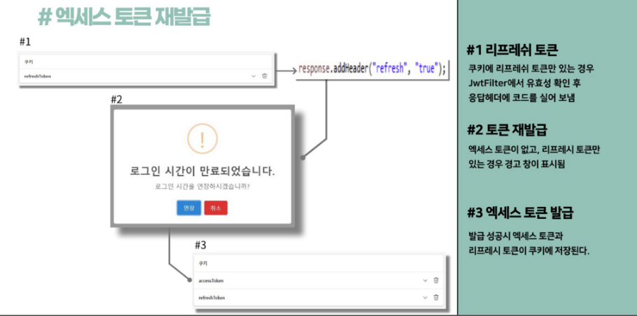

# 근태 관리 프로젝트

## 개발환경

- IntelliJ
- Postman
- GitHub
- Mysql Workbench
- Visual Studio Code

## 사용 기술

### 백엔드

**주요 프레임워크 / 라이브러리**

- Java 11 openjdk
- SpringBoot 2.7.7
- SpringBoot Security
- Spring Data JPA

**Build tool**

- Maven

**DataBase**

- MySql

**Infra**

- AWS EC2
- AWS S3
- AWS RDS

### 프론트엔드

- React
- MUI
- Redux

### 기타 주요 라이브러리

- Lombok

## 시스템 아키텍처

## ERD

## 기능 구성도

## 주요 기능

